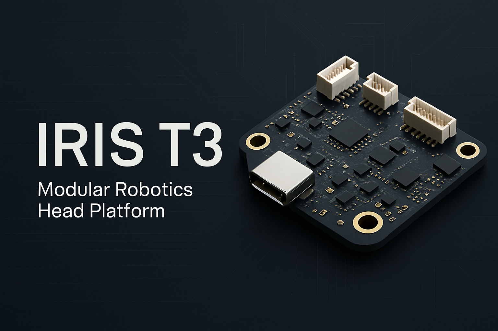

# IRIS T3 Carrier Board

## Modular, Hardware-Agnostic Robotics Head Platform for IRIS 2026

The **IRIS T3 Carrier Board** is a universal, low-cost, hardware-agnostic compute and sensor backbone designed for humanitarian robotics. It allows any user with an ESP32, Raspberry Pi Pico, or even a ruggedized USB-C smartphone to act as the “brain” of a T3-class robot.

This repository contains the design specifications, hardware interface definitions, and manufacturing documentation needed to produce the board across three prototype stages (v1 → v3).

---

## 📌 Project Purpose

IRIS aims to deliver resilient, modular robotics infrastructure for emergency response, community aid, and communication restoration.
The T3 Carrier Board is the foundation for:
*   Decentralized sensor processing
*   Mesh network propagation (QMesh / ESP-Mesh)
*   Device-agnostic compute
*   Simulation → real-world robotics experiments
*   Low-cost field-repairable aid robots

---

## 🔧 Board Capabilities

### Core Features
*   Universal MCU socket for ESP32-S3, Pico/PicoW, and compatible 3.3V microcontrollers
*   USB-C phone brain option for high-level compute
*   3.3V and 5V sensor rails
*   High-bandwidth connector for cameras or SPI/MIPI expansion
*   Power domain isolation and robust surge protection
*   Designed for rapid field repairs and modular upgrades

### Compatibility
*   ESP32-S3 DevKitC
*   Raspberry Pi Pico / PicoW
*   Raspberry Pi CM (via optional adapter)
*   Any Android/iOS phone via gimbal-mounted USB-C

---

## 📐 Board Layout

**Dimensions:** 85mm × 65mm  
**Mounting:** 4 × M3 plated holes  

### Connectors

| Location | Connector | Function |
| :--- | :--- | :--- |
| Top | USB-C | Phone compute + 5V input |
| Top | 2× JST-GH 4-pin | I2C sensor rails |
| Left | 40-pin MCU header | Universal compute block |
| Bottom | XT30 or barrel | Power input (5–15V) |
| Bottom | JST-GH 6-pin | High-bandwidth sensor/camera rail |
| Right | Header pads | UART, SWD, debug |

All connectors fully labeled on silkscreen.

---

## ⚡ Power Architecture

*   **Input:** 5–15V DC
*   **USB-C:** 5V VBUS input supported
*   **Rails:**
    *   V_HIGH: 5V
    *   V_LOGIC: 3.3V
    *   V_SYS: raw input
*   **Regulators:**
    *   Buck converter (MP1584EN footprint)
    *   3.3V LDO (AMS1117-3.3 or RT9080 footprint)

Includes polyfuse and USB ESD protection.

---

## 🧠 MCU Header Specification

A 40-pin hybrid header designed to accept multiple microcontroller form-factors.

**Required signal categories:**
*   2× I2C buses
*   2× SPI buses
*   2× UART buses
*   At least 6 ADC channels
*   Boot/Enable lines for ESP32
*   5V + 3.3V + GND distribution

**Example silk labels:**
```text
MCU_GPIO_01  
MCU_GPIO_02  
MCU_UART1_TX  
MCU_SPI0_MOSI  
MCU_I2C0_SDA  
MCU_ADC2  
...
```

---

## 📡 Sensor & Expansion Rails

### I2C Rails (2× JST-GH 4-pin)
1.  3.3V  
2.  SDA  
3.  SCL  
4.  GND

### High-Bandwidth Rail (JST-GH 6-pin)
1.  5V  
2.  MIPI/SPI_CLK+  
3.  MIPI/SPI_CLK-  
4.  DATA+  
5.  DATA-  
6.  GND

### Debug Pads
*   SWD
*   UART0
*   RESET + BOOT buttons

---

## 🎯 Prototype Roadmap

### Prototype 1 — Core Power + I/O
*   Power regulation stable
*   USB-C → MCU communication
*   I2C rails validated
*   Basic sensors + MCU swapping

### Prototype 2 — Expansion & Phone Integration
*   Gimbal-mounted phone compute
*   High-bandwidth sensor rail
*   Full MCU swap support
*   Clean routing + isolated grounds

### Prototype 3 — Field-Ready
*   Reinforced connectors
*   Surge and ESD-hardened
*   Official mechanical mount spec
*   Final BOM and gerbers ready for production

---

## 📦 Deliverables (for Engineers)

This repository contains:
*   `/schematics` → Full board schematic (PDF + KiCAD/Altium)
*   `/pcb` → PCB layout files
*   `/gerbers` → Manufacturing export set
*   `/3d-model` → STEP model for CAD/robotics integration
*   `/bom` → BOM with vendor links
*   `/docs` → Testing procedures, pinout documentation, expansion guides

---

## 🏗️ Manufacturing Notes

*   4-layer board recommended (top, GND plane, power plane, bottom).
*   Keep USB data lines impedance controlled.
*   Prefer matte-black or matte-blue solder mask for visibility.
*   Use JST-GH for all field-replaceable connectors.
*   Ground stitching vias along all board edges.

---

## 🚨 License

All IRIS hardware is released under the **IRIS Commons Hardware License**, allowing:
*   Free use for humanitarian aid, education, community research
*   Restricted use for military or extractive commercial exploitation

---

## 🛠 Contributing

IRIS welcomes electrical engineers, firmware developers, and community makers.
Forks, PRs, and discussions are open for:
*   Sensor modules
*   Compute adapters
*   Simulation-to-real bridging
*   Documentation and field repair guides

---

## 📞 Contact

For engineering or collaboration requests:
**IRIS Lab — Integrated Reality Information Systems**
Email: contact pending
GitHub: [RocknRye747/IRIS](https://github.com/RocknRye747/IRIS)
